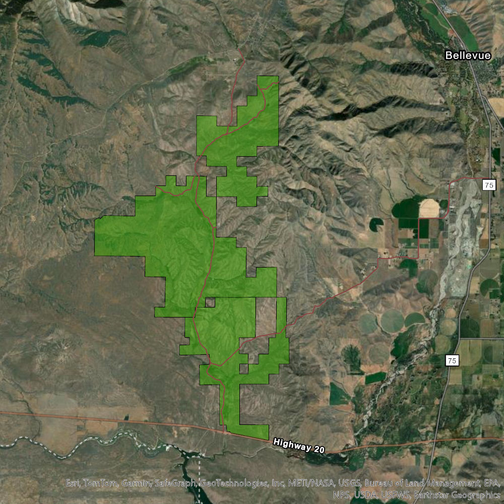

# A Foreward: Some Background for this Project

The greater sage-grouse (*Centrocercus urophasianus*) is the largest grouse species found in North America. They are emblematic of the sagebrush steppe landscape of the western United States because their population health is closely tied to this habitat and the resources found within it. However, the greater sage-grouse has experienced drastic declines in population level in recent decades; many factors can be attributed to this decline, one of which is loss of brood-rearing habitat. These are areas typically characterized by mesic conditions, with an abundance of insect and forb species that are essential for sage-grouse chicks (aka a *brood*) to consume in their first couple months of life.

Enter the beaver dams -- an incredibly powerful tool with respect to mesic habitat restoration and conservation. Dams impound water, and this water in turn alters the surrounding habitat in numerous ways, chiefly by encouraging the growth of a higher diversity of plant species than would occur in an otherwise dam-absent area. It is important to note that these dams do not have to be built by beavers themselves; beaver dam analogs (BDAs) are man-made dams, built with the purpose to mimic the function of natural ones.

The premise of this project is to explore the potential relationship that exists between brooding sage-grouse hens and habitat modified by beaver dams on the landscape. In the following chapters, we will manipulate sage-grouse GPS data and beaver dam data, and will follow code to explore the relationships that exist between them.

## Study Site

The research for this project takes place at Rinker Rock Creek Ranch, which is located southwest of Bellevue, Idaho. The ranch is comprised of about 10,000 acres of high-quality sagebrush steppe habitat, which supports robust populations of greater sage-grouse as well as many other species that coexist with the birds. The ranch is also home to numerous beaver dams located within its riparian areas, as well as BDAs that have been implemented over the years. Consequently, this area serves as a great system for this research project to take place in.

